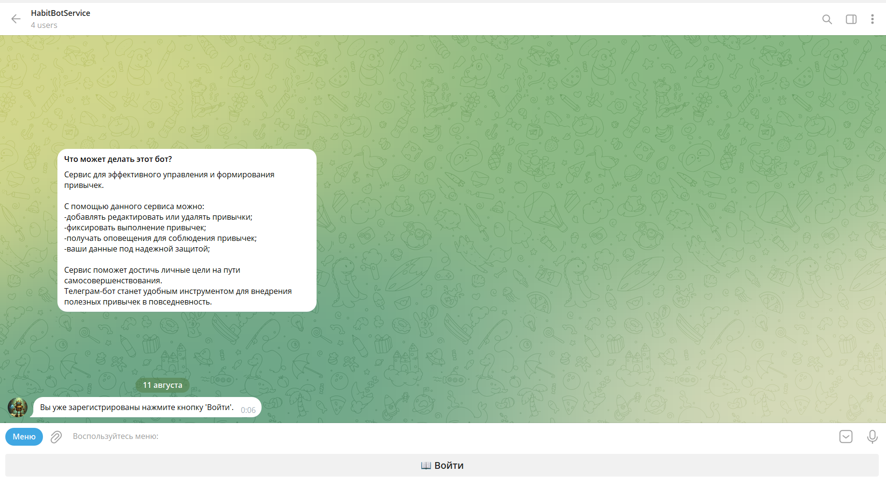

# Телеграмм бот для управления и формирования новых привычек.

С помощью данного сервиса пользователи могут быстрее и эффективнее осваивать новые привычки!

### Что умеет бот:
- Регистрировать нового пользователя;
- Проверять пользователя перед входом;
- Создавать и редактировать профиль пользователя;
- Создавать новую привычку;
- Редактировать созданные привычки;
- Просматривать список созданных привычек;
- Ставить отметки о выполнении или не выполнении заданий;
- Если отметка не поставлена, то по истечении суток она получит статус не выполненной;
- Удалять привычки;
- Получать напоминания о необходимости выполнить задание в удобное для пользователя время;
- Формировать список полностью выполненных заданий.

### Технические характеристики:
- Python
- FastAPI
- PostgreSQL
- SQLAlchemy (async)
- Система контроля версий Poetry
- Sentry - система мониторинга и отслеживания ошибок
- Adminer
- Alembic

Приложение можно развернуть на удаленном сервере поддерживающем работу Docker.
Для того что бы развернуть приложение, необходимо скопировать все файлы на удаленный сервер и запустить командой `docker-compose up -- build -d`

Web интерфейс управления базой данных http://localhost:8080

|Движок| PostgreSQL |
|------|------|
|Сервер| postgres_container |
|Имя пользователя| postgres |
|Пароль| **** |
|Имя базы данных| tweets_db |

